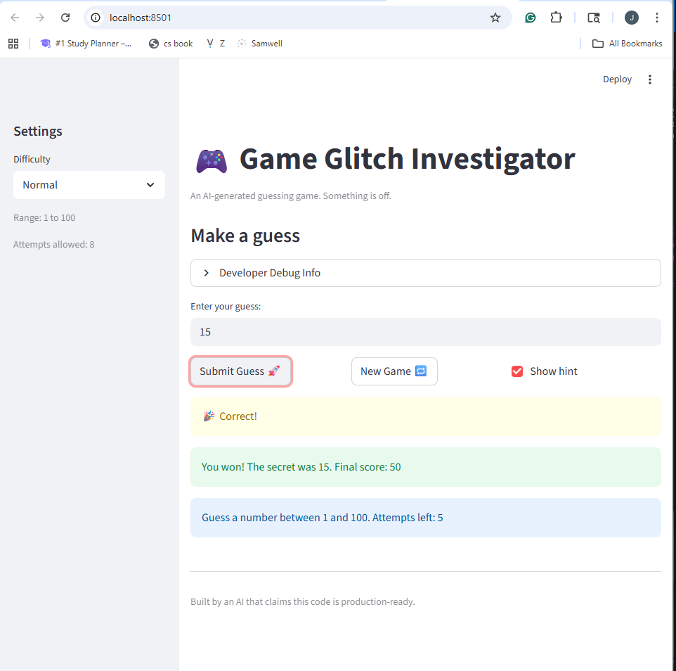

# 🎮 Game Glitch Investigator: The Impossible Guesser

## 🚨 The Situation

You asked an AI to build a simple "Number Guessing Game" using Streamlit.
It wrote the code, ran away, and now the game is unplayable. 

- You can't win.
- The hints lie to you.
- The secret number seems to have commitment issues.

## 🛠️ Setup

1. Install dependencies: `pip install -r requirements.txt`
2. Run the broken app: `python -m streamlit run app.py`

## 🕵️‍♂️ Your Mission

1. **Play the game.** Open the "Developer Debug Info" tab in the app to see the secret number. Try to win.
2. **Find the State Bug.** Why does the secret number change every time you click "Submit"? Ask ChatGPT: *"How do I keep a variable from resetting in Streamlit when I click a button?"*
3. **Fix the Logic.** The hints ("Higher/Lower") are wrong. Fix them.
4. **Refactor & Test.** - Move the logic into `logic_utils.py`.
   - Run `pytest` in your terminal.
   - Keep fixing until all tests pass!

## 📝 Document Your Experience

- [ ] Describe the game's purpose.
The game is a guessing game, where the game generate a random secret number. The user have 8 chance to guess the number and have the option to recieve hint. The hint will tell if they should go lower or higher.
- [ ] Detail which bugs you found.
1. The main bug was that the game ended while one attempt was remaining.
2. The game was inaccurate in telling the user to go higher or lower
3. The game was not able to load a new game
- [ ] Explain what fixes you applied.
1. I have made it so that the correct amount of attempt was shown and the game ended either when it was won or the attempt reaches zero,
2. I have fixed the code so a new game is loaded when the new game button was pressed
3. I have corrected the code where, instead of saying higher if the guessed number was greater than secret number-- it would display lower. 

## 📸 Demo

- [ ] [Insert a screenshot of your fixed, winning game here]

## 🚀 Stretch Features

- [ ] [If you choose to complete Challenge 4, insert a screenshot of your Enhanced Game UI here]
